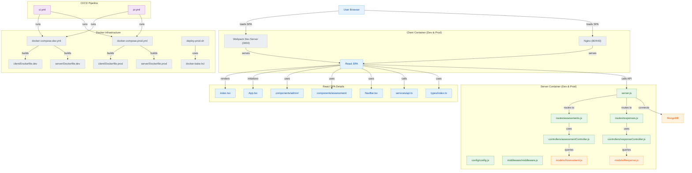

```mermaid
flowchart TD
    %% User Layer
    Browser["User Browser"]:::ui

    %% Frontend Container
    subgraph "Client Container (Dev & Prod)" 
        direction TB
        Webpack["Webpack Dev Server (3000)"]:::infra
        Nginx["Nginx (80/443)"]:::infra
        ReactSPA["React SPA"]:::ui
    end

    subgraph "React SPA Details"
        direction TB
        Index["index.tsx"]:::ui
        App["App.tsx"]:::ui
        AdminComp["components/admin/"]:::ui
        AssessComp["components/assessment/"]:::ui
        NavBar["NavBar.tsx"]:::ui
        APIService["services/api.ts"]:::ui
        Types["types/index.ts"]:::ui
    end

    %% Backend Container
    subgraph "Server Container (Dev & Prod)"
        direction TB
        Express["server.js"]:::api
        Config["config/config.js"]:::api
        Middleware["middleware/middleware.js"]:::api
        AssController["controllers/assessmentController.js"]:::api
        RespController["controllers/responseController.js"]:::api
        AssRoutes["routes/assessments.js"]:::api
        RespRoutes["routes/responses.js"]:::api
        AssModel["models/Assessment.js"]:::data
        RespModel["models/Response.js"]:::data
    end

    %% Database
    MongoDB["MongoDB"]:::data

    %% CI/CD
    subgraph "CI/CD Pipeline"
        direction TB
        CI_CI["ci.yml"]:::ci
        CI_PR["pr.yml"]:::ci
    end

    %% Docker & Deployment
    subgraph "Docker Infrastructure"
        direction TB
        ComposeDev["docker-compose.dev.yml"]:::infra
        ComposeProd["docker-compose.prod.yml"]:::infra
        ClientDevDocker["client/Dockerfile.dev"]:::infra
        ClientProdDocker["client/Dockerfile.prod"]:::infra
        ServerDevDocker["server/Dockerfile.dev"]:::infra
        ServerProdDocker["server/Dockerfile.prod"]:::infra
        BakeConfig["docker-bake.hcl"]:::infra
        DeployScript["deploy-prod.sh"]:::infra
    end

    %% Connections
    Browser -->|loads SPA| Webpack
    Browser -->|loads SPA| Nginx
    Webpack -->|serves| ReactSPA
    Nginx -->|serves| ReactSPA
    ReactSPA -->|renders| Index
    ReactSPA -->|initializes| App
    ReactSPA -->|uses| AdminComp
    ReactSPA -->|uses| AssessComp
    ReactSPA -->|uses| NavBar
    ReactSPA -->|calls| APIService
    ReactSPA -->|uses| Types
    ReactSPA -->|calls API| Express
    Express -->|routes to| AssRoutes
    Express -->|routes to| RespRoutes
    AssRoutes -->|uses| AssController
    RespRoutes -->|uses| RespController
    AssController -->|queries| AssModel
    RespController -->|queries| RespModel
    Express -->|connects| MongoDB
    CI_CI -->|runs| ComposeDev
    CI_CI -->|runs| ComposeProd
    CI_PR -->|runs| ComposeDev
    CI_PR -->|runs| ComposeProd
    ComposeDev -->|builds| ClientDevDocker
    ComposeDev -->|builds| ServerDevDocker
    ComposeProd -->|builds| ClientProdDocker
    ComposeProd -->|builds| ServerProdDocker
    DeployScript -->|uses| BakeConfig

    %% Click Events
    click Index "https://github.com/srajasimman/mern-assessment-app/blob/main/client/src/index.tsx"
    click App "https://github.com/srajasimman/mern-assessment-app/blob/main/client/src/App.tsx"
    click AdminComp "https://github.com/srajasimman/mern-assessment-app/tree/main/client/src/components/admin/"
    click AssessComp "https://github.com/srajasimman/mern-assessment-app/tree/main/client/src/components/assessment/"
    click NavBar "https://github.com/srajasimman/mern-assessment-app/blob/main/client/src/components/layout/NavBar.tsx"
    click APIService "https://github.com/srajasimman/mern-assessment-app/blob/main/client/src/services/api.ts"
    click Types "https://github.com/srajasimman/mern-assessment-app/blob/main/client/src/types/index.ts"
    click ReactSPA "https://github.com/srajasimman/mern-assessment-app/tree/main/client/src/"
    click Webpack "https://github.com/srajasimman/mern-assessment-app/blob/main/client/Dockerfile.dev"
    click Nginx "https://github.com/srajasimman/mern-assessment-app/blob/main/client/nginx.conf"
    click Express "https://github.com/srajasimman/mern-assessment-app/blob/main/server/server.js"
    click Config "https://github.com/srajasimman/mern-assessment-app/blob/main/server/config/config.js"
    click Middleware "https://github.com/srajasimman/mern-assessment-app/blob/main/server/middleware/middleware.js"
    click AssController "https://github.com/srajasimman/mern-assessment-app/blob/main/server/controllers/assessmentController.js"
    click RespController "https://github.com/srajasimman/mern-assessment-app/blob/main/server/controllers/responseController.js"
    click AssRoutes "https://github.com/srajasimman/mern-assessment-app/blob/main/server/routes/assessments.js"
    click RespRoutes "https://github.com/srajasimman/mern-assessment-app/blob/main/server/routes/responses.js"
    click AssModel "https://github.com/srajasimman/mern-assessment-app/blob/main/server/models/Assessment.js"
    click RespModel "https://github.com/srajasimman/mern-assessment-app/blob/main/server/models/Response.js"
    click CI_CI "https://github.com/srajasimman/mern-assessment-app/blob/main/.github/workflows/ci.yml"
    click CI_PR "https://github.com/srajasimman/mern-assessment-app/blob/main/.github/workflows/pr.yml"
    click ComposeDev "https://github.com/srajasimman/mern-assessment-app/blob/main/docker-compose.dev.yml"
    click ComposeProd "https://github.com/srajasimman/mern-assessment-app/blob/main/docker-compose.prod.yml"
    click ClientDevDocker "https://github.com/srajasimman/mern-assessment-app/blob/main/client/Dockerfile.dev"
    click ClientProdDocker "https://github.com/srajasimman/mern-assessment-app/blob/main/client/Dockerfile.prod"
    click ServerDevDocker "https://github.com/srajasimman/mern-assessment-app/blob/main/server/Dockerfile.dev"
    click ServerProdDocker "https://github.com/srajasimman/mern-assessment-app/blob/main/server/Dockerfile.prod"
    click BakeConfig "https://github.com/srajasimman/mern-assessment-app/blob/main/docker-bake.hcl"
    click DeployScript "https://github.com/srajasimman/mern-assessment-app/blob/main/deploy-prod.sh"

    %% Styles
    classDef ui fill:#E3F2FD,stroke:#64B5F6,color:#0D47A1
    classDef api fill:#E8F5E9,stroke:#66BB6A,color:#1B5E20
    classDef data fill:#FFF3E0,stroke:#FFA726,color:#E65100
    classDef infra fill:#ECEFF1,stroke:#B0BEC5,color:#37474F
    classDef ci fill:#F3E5F5,stroke:#BA68C8,color:#4A148C
```